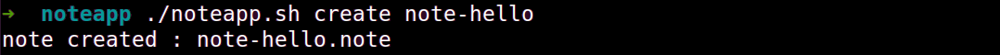
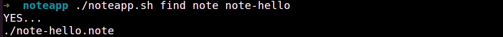
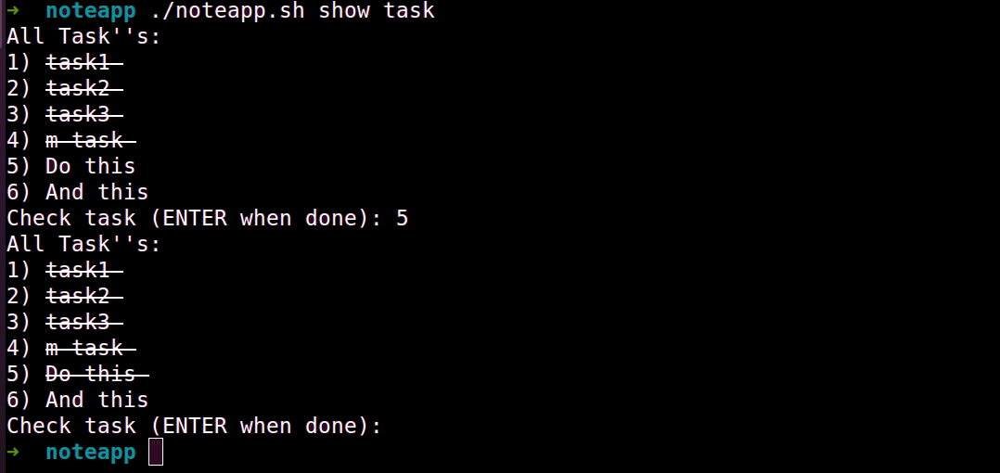

# Bash :: Notes-App

## Overview 
A simple **Note taking** and **TODO list** app in BASH.
Quick and easy way to create notes and todo list without leaving CLI.

## More with this
* You can use this as README template.
* The script shows the power of the Linux Command line. Each line is doing its own things. More can be found with noteapp_doc.sh. This file contains lots of comments so that you can use individual lines too. 


## Goals
* Notes  : Create notes via CLI.
* Tasks :  Create Task/TODO list.


## Specifications
* Add note
* Show note
* Delete note
* Update note
* Add task
* Show tasks
* Check task ( done status )


## Milestones
* **Make notes (✓)**

   Create notes on the fly.

* **Make tasks (✓)**
  
  Create tasks. 

* **Tasks status (✓)**
  
  Show completed tasks as Make  Bash Note App

## Usage

```bash
wget  https://github.com/akash-nagwanshi/notesApp/blob/main/notesapp.sh &&  chmod a+x notesapp.sh
```

## List of commands
```bash
./notesapp create note1  // to create note named as note1
```
 | 

```bash
./notesapp add note1 // to add contents into note1
```


```bash
./notesapp show note1 // to show contents of note1
```


```bash
./notesapp delete note1 // to delete note1
```

```bash
./notesapp find note note1 // will check is there any note with named note1
```


```bash
./notesapp find data “data to find” // to find data in all notes
```

```bash
./notesapp add task 'task name'  // to add task
```


```bash
./notesapp show task // to show all task , and to manipulate them
```

